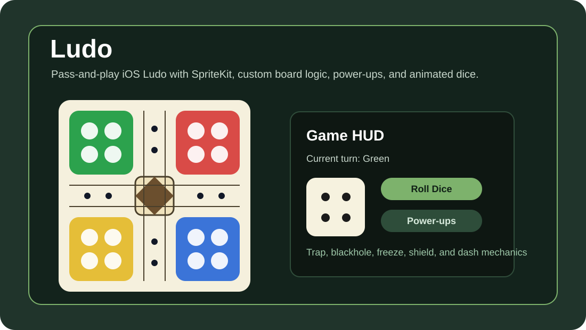

# Ludo Game

An iOS Ludo game built with Swift, UIKit, and SpriteKit. The project includes a pass-and-play setup flow, animated board scene, custom dice, player tokens, and power-up mechanics.




## Features

- Pass-and-play mode for 2 to 4 players.
- SpriteKit game board with animated tokens and dice.
- Opening roll flow to decide the starting player.
- Custom Ludo movement engine and board path logic.
- Power-up mechanics including dash, trap, blackhole, freeze, and shield.
- Game-over summary and in-game menu flow.
- Unit test and UI test targets included.

## Tech Stack

- Swift
- UIKit
- SpriteKit
- Xcode

## Project Structure

```text
ludo/
  GameScene.swift
  GameViewController.swift
  HomeViewController.swift
  GameSetupFlowViewController.swift
  LudoPassAndPlayEngine.swift
  LudoPowerup.swift
  LudoBoardBuilder.swift
ludoTests/
ludoUITests/
ludo.xcodeproj/
```

## Run Locally

1. Open `ludo.xcodeproj` in Xcode.
2. Select an iPhone simulator or connected device.
3. Press **Run**.
4. Tap **Start**, choose **Pass and Play**, then select 2 to 4 players.

## Notes

The `Archive` folder contains backup copies from earlier development work. The active game code lives in the `ludo` directory.
